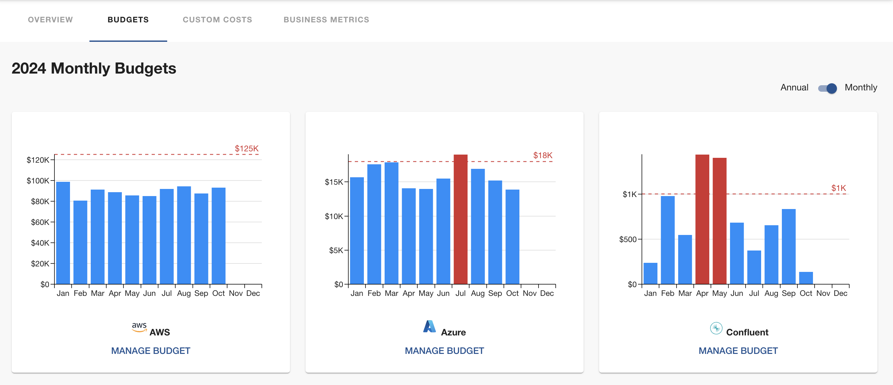

## Try InfraWallet in Docker

Though InfraWallet is a plugin for Backstage, you can explore it quickly using its Docker image. Run the following command and access InfraWallet via `http://localhost:7007`:

```bash
docker run --rm -p 7007:7007 opensourceelectrolux/infrawallet:latest
```

This image contains a Backstage instance with InfraWallet installed. It uses a Mock client to generate cloud costs. If
you would like to try InfraWallet with your cloud credentials, you can create a app-config.infrawallet.yaml file (see [example](../app-config.infrawallet.yaml) here) according to the
following instructions, and then run the following command instead:

```bash
docker run --rm -p 7007:7007 -v <path_to_your_config_file>:/app/app-config.infrawallet.yaml opensourceelectrolux/infrawallet:latest
```

## Default Settings for Frontend

Site admins can configure the default view for InfraWallet, including the default group by dimension, and the default
query period. Add the following configurations to your `app-config.yaml` file if the default view needs to be changed.

```yaml
# note that infraWallet exists at the root level, it is not the same one for backend configurations
infraWallet:
  settings:
    defaultGroupBy: none # none by default, or account, provider, category, service, tag:<tag_key>
    defaultShowLastXMonths: 3 # 3 by default, or other numbers, we recommend it less than 12
```

### Customizing the InfraWalletPage Title and Subtitle

By default, the `InfraWalletPage` component is configured in the `packages/app/src/App.tsx` file as follows:

```ts
<Route path="/infrawallet" element={<InfraWalletPage />} />
```

To customize the title and subtitle of the InfraWalletPage, you can modify the route in the same file as shown below:

```ts
<Route path="/infrawallet" element={<InfraWalletPage title="Custom title" subTitle="Custom subTitle" />} />
```

## Defining Provider Integrations

InfraWallet's configuration schema is specified in in [plugins/infrawallet-backend/config.d.ts](../plugins/infrawallet-backend/config.d.ts). To set up provider integrations, users must configure them in the `app-config.yaml` file located in the root directory.

### AWS Integration

InfraWallet uses an IAM role to retrieve cost and usage data via the AWS Cost Explorer APIs. Before configuring InfraWallet, you must set up the necessary AWS IAM role and policy.

#### For Management Accounts

If you have a [management account](https://docs.aws.amazon.com/organizations/latest/userguide/orgs_getting-started_concepts.html#management-account), this setup only needs to be done once within the management account. InfraWallet will then be able to retrieve cost data across all [member accounts](https://docs.aws.amazon.com/organizations/latest/userguide/orgs_getting-started_concepts.html#member-account).

#### For Non-Management Accounts

If you're not using a [management account](https://docs.aws.amazon.com/organizations/latest/userguide/orgs_getting-started_concepts.html#management-account), you'll need to create a role in each AWS account and configure trust relationships individually.

#### Required IAM Role Permissions

The IAM role must have the following permissions to access cost and usage data:

```json
{
  "Statement": [
    {
      "Action": ["ce:GetCostAndUsage", "ce:GetTags"],
      "Effect": "Allow",
      "Resource": "*",
      "Sid": ""
    }
  ],
  "Version": "2012-10-17"
}
```

#### Configuration

Once the IAM roles and policies are in place, add the following configuration to your `app-config.yaml` file:

```yaml
backend:
  infraWallet:
    integrations:
      aws:
        - name: <unique_name_of_this_integration>
          accountId: '<12-digit_account_ID>' # quoted as a string
          assumedRoleName: <name_of_the_AWS_IAM_role_to_be_assumed> # optional, only needed if you want to assume a role
          accessKeyId: <access_key_ID_of_AWS_IAM_user_that_assumes_the_role> # optional, only needed when an IAM user is used. if assumedRoleName is also provided, this user is used to assume the role
          accessKeySecret: <access_key_secret_of_AWS_IAM_user_that_assumes_the_role> # optional, only needed when an IAM user is used. if assumedRoleName is also provided, this user is used to assume the role
```

InfraWallet's AWS client is built using the AWS SDK for JavaScript. If both `accessKeyId` and `accessKeySecret` are provided in the configuration, the client will use the specified IAM user. If `assumedRoleName` is set, the client will assume that role (if `accessKeyId` and `accessKeySecret` is also provided, that IAM user will assume the role). Otherwise, it follows the [default credential provider chain](https://docs.aws.amazon.com/sdk-for-javascript/v3/developer-guide/setting-credentials-node.html#credchain).

When your environment already has the AWS auth in-place, the configuration will look like this:

```yaml
backend:
  infraWallet:
    integrations:
      aws:
        - name: <unique_name_of_this_integration>
          accountId: '<12-digit_account_ID>' # quoted as a string
```

### Azure Integration

To manage Azure costs with InfraWallet, you need to register an application in Azure. Note that InfraWallet has been tested with subscription-level cost data only.

#### Steps

1. After registering the application, navigate to the `Subscriptions` page and select the target subscription.
2. Go to the `Access control (IAM)` section and assign the `Cost Management Reader` role to the newly created application.
3. Generate a client secret for the application.

Add the following configurations to your `app-config.yaml` file:

```yaml
backend:
  infraWallet:
    integrations:
      azure:
        - name: <unique_name_of_this_integration>
          subscriptionId: <Azure_subscription_ID>
          tenantId: <Azure_tenant_ID>
          clientId: <Client_ID_of_the_created_application>
          clientSecret: <Client_secret_of_the_created_application>
```

### GCP Integration

InfraWallet relies on GCP Big Query to fetch cost data. This means that the billing data needs to be exported to a big query dataset, and a service account needs to be created for InfraWallet. The steps of exporting billing data to Big Query can be found [here](https://cloud.google.com/billing/docs/how-to/export-data-bigquery). Then, visit Google Cloud Console and navigate to the `IAM & Admin` section in the billing account. Click `Service Accounts`, and create a new service account. The service account needs to have `BigQuery Data Viewer` and `BigQuery Job User` roles. On the `Service Accounts` page, click the three dots (menu) in the `Actions` column for the newly created service account and select `Manage keys`. There click `Add key` -> `Create new key`, and use `JSON` as the format. Download the JSON key file and keep it safe.

After setting up the resources above, add the following configurations in `app-config.yaml`:

```yaml
backend:
  infraWallet:
    integrations:
      gcp:
        - name: <unique_name_of_this_integration>
          keyFilePath: <path_to_your_json_key_file> # Supports environment variables, tilde expansion
          projectId: <GCP_project_that_your_big_query_dataset_belongs_to>
          datasetId: <big_query_dataset_id>
          tableId: <big_query_table_id>
```

The `keyFilePath` supports multiple formats:

- Absolute paths: `/path/to/key.json`
- Relative paths: `./path/to/key.json`
- Home directory expansion: `~/path/to/key.json`
- Environment variables: `$HOME/.config/gcloud/key.json` or `${HOME}/.config/gcloud/key.json`

InfraWallet will also check for the standard `GOOGLE_APPLICATION_CREDENTIALS` environment variable. You have these authentication options in order of precedence:

1. Explicitly configured `keyFilePath` in app-config.yaml (highest priority)
2. `GOOGLE_APPLICATION_CREDENTIALS` environment variable
3. Application Default Credentials from standard locations

If none of these options are successful, you'll see appropriate error messages in the logs to help troubleshoot the issue.

### Confluent Cloud Integration

To manage Confluent Cloud costs, you need to create an API key (Service account) for your Organization with the 'Cloud resource management' resource scope, you can find the documentation [here](https://docs.confluent.io/cloud/current/security/authenticate/workload-identities/service-accounts/api-keys/manage-api-keys.html#add-an-api-key). Once you have your API key details, add the following settings to `app-config.yaml`:

```yaml
backend:
  infraWallet:
    integrations:
      confluent:
        - name: <unique_name_of_this_integration>
          apiKey: <your_api_key>
          apiSecret: <your_api_key_secret>
```

### MongoDB Atlas Integration

To manage MongoDB Atlas costs, you need to create an API key for your Organization with `Organization Billing Viewer` permission, you can find the documentation [here](https://www.mongodb.com/docs/atlas/configure-api-access/#std-label-about-org-api-keys). Once you have your API key details, add the following settings to `app-config.yaml`:

```yaml
backend:
  infraWallet:
    integrations:
      mongoatlas:
        - name: <unique_name_of_this_integration>
          orgId: <id_organization_mongo_atlas>
          publicKey: <public_key_of_your_api_key>
          privateKey: <private_key_of_your_api_key>
```

### Datadog Integration

To manage Datadog costs, you need to create an API key and an Application Key for your Organization, or [Parent Organization](https://docs.datadoghq.com/account_management/multi_organization/) (if you have Multiple-Organization Accounts), with `usage_read` permission. You can find the documentation [here](https://docs.datadoghq.com/account_management/api-app-keys/). Add the following settings to `app-config.yaml`:

```yaml
backend:
  infraWallet:
    integrations:
      datadog:
        - name: <unique_name_of_this_integration>
          apiKey: <your_api_key>
          applicationKey: <your_application_key>
          ddSite: <your_site> # e.g. https://api.datadoghq.eu
```

Datadog doesn't provide daily costs. Current daily costs are calculated by `monthly costs/number of days in that month`.

## Autoloading Cost Data and Saving Them Into the Database

In order to improve the performance and reduce the number of calls to the cloud providers, by default, for all the integrations, there is a scheduled [task](../plugins/infrawallet-backend/src/service/router.ts#L57) in the InfraWallet backend that queries the cost data from the cloud provider APIs and saves them into the database (tables `cost_items_daily` and `cost_items_monthly`). The default interval for this task is 8 hours which will be made configurable in the future. It is recommended to have a value that is larger or equal to 8 because most of the cloud providers do not update the cost data very frequently. This feature works similarly as caching but it only autloads the costs data without any filters (such as a cost allocation tag filter in AWS). If a query contains such a filter condition, InfraWallet still makes API calls to the cloud and then caches the data in memory isntead of the database.

If you want to disable this feature, for example, when you run a local development environment with a Sqlite3 database, you can add the following configuration to your `app-config.yaml` file:

```yaml
backend:
  infraWallet:
    autoload:
      enabled: false
```

If there is an issue about the historical data in the plugin database, you can use the following two APIs to clean up
the data and reload the data.

```bash
# for a prod environment, you may need extra headers like an auth token, etc.

# the following call removes the costs data from the database
curl -X POST -d '{"granularity": "monthly", "provider": "AWS"}' --header 'Content-Type: application/json' http://localhost:7007/api/infrawallet/default/delete_cost_items

# the following call triggers the fetch and save cloud costs task immediately
curl http://localhost:7007/api/infrawallet/fetch_and_save_costs
```

## Integration Filter

When integrating InfraWallet with your billing account, you have the ability to retrieve and display costs for all sub-accounts. However, if you want to limit the visibility of certain accounts, you can apply filters. Below is an example of how to configure this for AWS:

```yaml
backend:
  infraWallet:
    integrations:
      aws:
        - name: <unique_name_of_this_integration>
          accountId: '<12-digit_account_ID>' # quoted as a string
          ...
          filters:
            - type: include # 'include' or 'exclude'
              attribute: account
              pattern: <regex_for_account_names> # Use a valid regex pattern to specify accounts
```

Currently, only AWS and Datadog integrations support filters.

## Custom Costs

If there is no integration available for some cloud costs, you can add them manually using the Custom Costs UI in InfraWallet. The table on this page displays all saved custom
costs within InfraWallet's database.

Currently, custom costs are only available at the monthly level. When viewing costs with `daily` granularity, monthly custom costs can be transformed into daily costs using the following amortization modes:

- Average (default): The monthly cost is divided evenly across all days in the month.
- First day: The full monthly cost is assigned to the first day of the month.
- End day: The full monthly cost is assigned to the last day of the month.

To add multiple custom cost records for a single provider, use the `Bulk Add` button. Enter details such as provider, monthly cost, start month, and end month, then check the preview and save the records.

## Budgets

You can track your annual spending from the Budgets page. To set a budget for a provider, click the `Manage Budget` button, then enter the desired annual budget. This will allow you to monitor spending against your set budget and adjust as needed throughout the year.

You can easily toggle between annual and monthly views to see spending trends and budget usage.



## Install the Plugin

### If Backstage New Backend System is enabled

1. add InfraWallet frontend

```
# From your Backstage root directory
yarn --cwd packages/app add @electrolux-oss/plugin-infrawallet
```

modify `packages/app/src/App.tsx` and add the following code

```ts
...
import { InfraWalletPage } from '@electrolux-oss/plugin-infrawallet';
...
<FlatRoutes>
    ...
    <Route path="/infrawallet" element={<InfraWalletPage />} />
</FlatRoutes>
...
```

2. add InfraWallet backend

```
# From your Backstage root directory
yarn --cwd packages/backend add @electrolux-oss/plugin-infrawallet-backend
```

modify `packages/backend/src/index.ts` and add the following code before `backend.start()`;

```typescript
...
// InfraWallet backend
backend.add(import('@electrolux-oss/plugin-infrawallet-backend'));
...
backend.start();
```

3. add cloud account credentials to `app-config.yaml`
   Here is an example of the configuration for AWS and Azure accounts:

```yaml
backend:
  infraWallet:
    integrations:
      azure:
        - name: <unique_name_of_this_integration>
          subscriptionId: ...
          tenantId: ...
          clientId: ...
          clientSecret: ...
        - name: <unique_name_of_this_integration>
          subscriptionId: ...
          tenantId: ...
          clientId: ...
          clientSecret: ...
      aws:
        - name: <unique_name_of_this_integration>
          accountId: '<12-digit_account_ID_as_string>'
          assumedRoleName: ...
          accessKeyId: ...
          accessKeySecret: ...
        - name: <unique_name_of_this_integration>
          accountId: '<12-digit_account_ID_as_string>'
          assumedRoleName: ...
          accessKeyId: ...
          accessKeySecret: ...
```

4. add InfraWallet to the sidebar (optional)

modify `packages/app/src/components/Root/Root.tsx` and add the following code

```ts
...
import { InfraWalletIcon } from '@electrolux-oss/plugin-infrawallet';
...
    <Sidebar>
      ...
      <SidebarGroup label="Menu" icon={<MenuIcon />}>
        <SidebarItem
          icon={InfraWalletIcon}
          to="infrawallet"
          text="InfraWallet"
        />
      </SidebarGroup>
      ...
    </Sidebar>
```

5. integrate InfraWallet with Backstage catalog (optional)

modify `packages/app/src/components/catalog/EntityPage.tsx` and add the following code

```ts
...
import {EntityInfraWalletCard, isInfraWalletAvailable } from '@electrolux-oss/plugin-infrawallet';
...

    <EntitySwitch>
      <EntitySwitch.Case if={isInfraWalletAvailable}>
        <Grid item md={6}>
          <EntityInfraWalletCard />
        </Grid>
      </EntitySwitch.Case>
    </EntitySwitch>
...
```

Note that the `EntityInfraWalletCard` only shows up when an entity has at least one of the following annotations:

- `infrawallet.io/project`
- `infrawallet.io/account`
- `infrawallet.io/service`
- `infrawallet.io/category`
- `infrawallet.io/provider`
- `infrawallet.io/extra-filters`
- `infrawallet.io/tags` (requires the `infrawallet.io/provider` annotation)

These annotations are used to filter the costs, similarly to the `Filters` component in the InfraWallet main page.
`infrawallet.io/extra-filters` takes a string like `"key-x: value-x, key-y: value-y"` as its input while the others take
a single string value. When there are multiple annotations, the fetched costs data will meet all of the given filters.

### If the legacy Backstage backend system is used

The 2nd step above (adding the backend) is different and it should be like the following.

```
# From your Backstage root directory
yarn --cwd packages/backend add @electrolux-oss/plugin-infrawallet-backend
```

create a file `infrawallet.ts` in folder `packages/backend/src/plugins/` with the following content.

```ts
import { createRouter } from '@electrolux-oss/plugin-infrawallet-backend';
import { Router } from 'express';
import { PluginEnvironment } from '../types';

export default async function createPlugin(env: PluginEnvironment): Promise<Router> {
  return await createRouter({
    logger: env.logger,
    config: env.config,
    cache: env.cache.getClient(),
    database: env.database,
  });
}
```

then modify `packages/backend/src/index.ts`

```ts
...
import infraWallet from './plugins/infrawallet';
...
async function main() {
  ...
  const infraWalletEnv = useHotMemoize(module, () => createEnv('infrawallet'));
  ...
  apiRouter.use('/infrawallet', authMiddleware, await infraWallet(infraWalletEnv));
  ...
}
```
