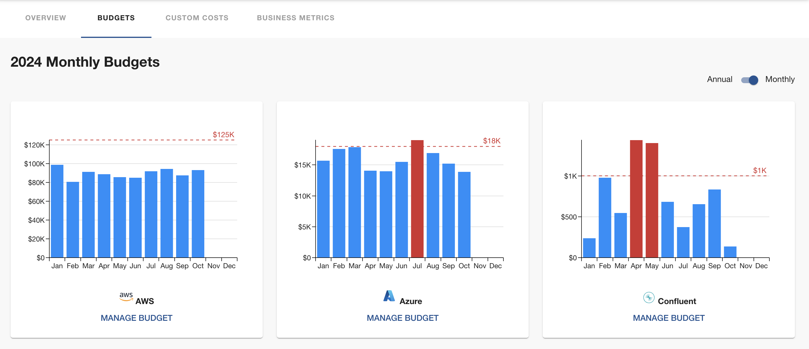

# Budgets

You can track your annual spending from the Budgets page. To set a budget for a provider, click the `Manage Budget` button, then enter the desired annual budget. This will allow you to monitor spending against your set budget and adjust as needed throughout the year.

You can easily toggle between annual and monthly views to see spending trends and budget usage.

