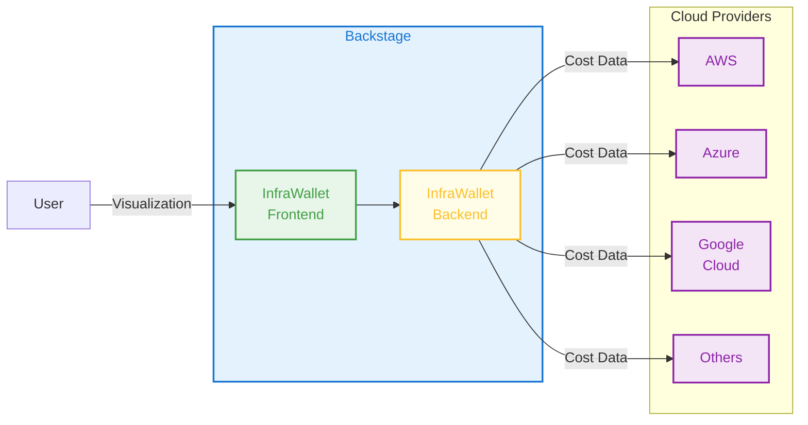

# InfraWallet

> _Control your cloud costs just in the way how you control your bank accounts_

InfraWallet is a powerful [Backstage](https://backstage.io/) plugin designed to help organizations gain full visibility and control over their cloud costs. By aggregating, categorizing, and analyzing costs across multiple cloud providers, InfraWallet empowers teams to make informed financial decisions and optimize their cloud spending.

With its seamless integration into Backstage, InfraWallet provides a unified interface for managing cloud costs, enabling teams to collaborate effectively. Whether you're tracking costs for AWS, Azure, Google Cloud, or other providers, InfraWallet simplifies cost management with its intuitive features and flexible configuration options.

## How it Works

## Highlights

- **Multi-Cloud Cost Aggregation**: Aggregate cloud costs across multiple platforms and accounts with ease.
- **Cost Categorization**: Group and analyze costs across different cloud providers using configurable category mappings.
- **Fast and Responsive**: Leverage cached cost data for swift response times and rapid access to financial insights.
- **Production-Ready**: Easy to configure and deploy as a Backstage plugin, with both frontend and backend components ready for production use.
