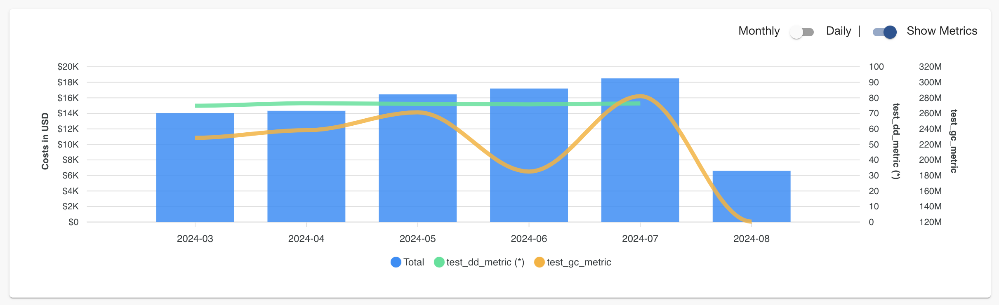

## Display Business Metrics Together With Costs Data

To better understand the trend of your cloud costs, it can be very helpful to check business metrics at the same time.
For example, an increase of some cloud costs may be caused by the larger number of active users, which justify the cost
increase.

As a beta feature, InfraWallet supports fetching metrics from different providers (Datadog and GrafanaCloud are
supported for now) and then show such metrics as line charts on the same cost graph. Here is an example of how it looks:



### Datadog

InfraWallet uses Datadog's [Query timeseries points](https://docs.datadoghq.com/api/latest/metrics/#query-timeseries-points) API to fetch metric points. Before jumping into the `app-config.yaml`, you need to create an API key and an application key for InfraWallet, see the official documentations [here](https://docs.datadoghq.com/account_management/api-app-keys/). If the application key is scoped, it needs to have the `timeseries_query` scope.

The configuration for a Datadog metric provider looks like the following:

```yaml
backend:
  infraWallet:
    metricProviders:
      datadog:
        # it is possible to have multiple datadog metric providers
        - name: <unique_name_of_this_provider>
          apiKey: <the_created_api_key>
          applicationKey: <the_created_app_key>
          ddSite: https://api.datadoghq.eu # see alternatives in https://docs.datadoghq.com/getting_started/site/#access-the-datadog-site
          metrics:
            # it is possible to fetch multiple metrics from one provider
            - metricName: <display_name_of_this_metric>
              description: <some_optional_descriptions>
              query: <datadog_query> # e.g., avg:system.cpu.idle{*}
```

**Note:**

Because InfraWallet only has daily or monthly granularities for costs, it is recommended to add a [rollup](https://docs.datadoghq.com/dashboards/functions/rollup/)
function to each query. Regarding the aggregation interval, `IW_INTERVAL` can be used as a placeholder and later on,
InfraWallet replaces it with the actual value (`86400` or `2592000`) based on the granularity. For example:

```
avg:system.cpu.idle{*}.rollup(avg, IW_INTERVAL)
```

### GrafanaCloud

InfraWallet uses GrafanaCloud's [Query a data source](https://grafana.com/docs/grafana-cloud/developer-resources/api-reference/http-api/data_source/#query-a-data-source) API to fetch metric points. In order to connect your GrafanaCloud organization, you need to create a service account and a token. The documentation can be found [here](https://grafana.com/docs/grafana/latest/administration/service-accounts/#create-a-service-account-in-grafana). After creating the service account token, add the following part into the configuration:

```yaml
backend:
  infraWallet:
    metricProviders:
      grafanacloud:
        # it is possible to have multiple GrafanaCloud metric providers
        - name: <unique_name_of_this_provider>
          url: <link_to_the_site> # e.g., https://foo.grafana.net
          datasourceUid: <uid_of_the_target_datasource>
          token: <service_account_token>
          metrics:
            # it is possible to fetch multiple metrics from one provider
            - metricName: <display_name_of_this_metric>
              description: <some_optional_descriptions>
              query: <query_string> # e.g., active_user{}
```

**Note:**

Similar to Datadog, it is recommended to apply an [aggregation_over_time()](https://prometheus.io/docs/prometheus/latest/querying/functions/#aggregation_over_time) for each query considering the granularity. For instance:

```
max(max_over_time(active_user[IW_INTERVAL]))
```
